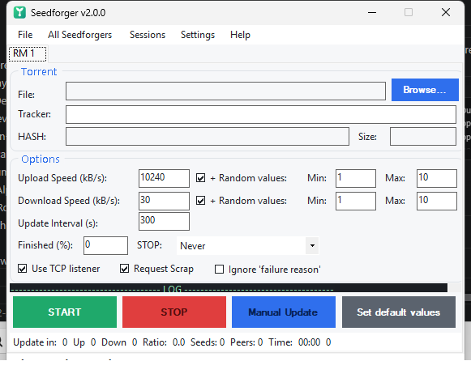

<div align="center">

# 🌱 Seedforger

**Tell any BitTorrent tracker whatever upload/download stats you want — without moving a single byte.**

A modern, from-the-ground-up .NET 8 revival of the classic *RatioMaster*.

[](https://github.com/Guillain-RDCDE/Seedforger/actions/workflows/ci.yml)
[](https://dotnet.microsoft.com/download/dotnet/8.0)
[](LICENSE)



</div>

---

Seedforger connects to a torrent tracker and **announces fake progress** (uploaded / downloaded / left) on your behalf. It impersonates a **real BitTorrent client** — matching `peer_id` and `User-Agent` fingerprints — so the announce looks exactly like the real thing. No files are ever transferred; only the numbers the tracker sees are made up.

It works **independently of your torrent client** — you don't even need one installed.

> [!WARNING]
> **This is an educational / security-research tool.** Faking your ratio breaks the rules of virtually every private tracker and **will get you banned** if you're caught. Only use it where you are allowed to. You alone are responsible for what you do with it.

---

## 🌱 For everyone — the 60-second guide

**In plain words:** you give Seedforger a `.torrent` file and tell it *"pretend I'm uploading at 10 MB/s"*. It quietly tells the tracker that story, over and over, so your stats go up. That's the whole idea.

### Get it running
1. Install the **[.NET 8 Desktop Runtime](https://dotnet.microsoft.com/download/dotnet/8.0)** (one-time, free, from Microsoft).
2. Download `Seedforger.exe` from the [Releases](../../releases) page *(or build it yourself — see the developer section)*.
3. Double-click it. No installation — it's a single portable app.

### Use it
1. **Browse…** and pick your `.torrent` file.
2. Set the **Upload Speed** (in kB/s) — how fast you want to "seed".
3. Choose a **Client** to impersonate — **qBittorrent 5.2.3** is a great, modern default.
4. Hit the green **START** button. Watch the **Ratio** and the log update.
5. Hit the red **STOP** when you're done.

### A few common-sense tips
- **Keep it believable.** Announcing that you seeded 900 GB in ten minutes is a great way to get flagged. Realistic speeds win.
- Leave **Realistic speed (ramp-up)** on (Settings menu) — it makes your fake speed climb and wobble like a real client instead of a robotic flat line.
- Use a **current** client (qBittorrent, Transmission 4, Deluge 2). Old clients stand out.

---

## 🔧 For power users & developers

### What's under the hood
| Area | What Seedforger does |
|---|---|
| **Client database** | Data-driven profiles (**47 clients**), not a hard-coded switch. Add/override any client via an external `clients.json` — **no recompile**. |
| **Modern fingerprints** | qBittorrent `-qB`, Transmission `-TR`, Deluge `-DE`, libtorrent `-LT`, plus all the legacy clients. Fingerprints verified against libtorrent's `generate_fingerprint` and each client's source. |
| **HTTPS trackers** | Full TLS support via `SslStream`, sending a raw hand-built HTTP request so header order / User-Agent stay byte-accurate. |
| **Realistic announces** | `SpeedShaper` applies a ramp-up + mean-reverting random walk instead of flat noise, so reported speeds look human. |
| **Portable settings** | Everything is stored in `settings.json` next to the exe. **No registry**, fully portable. |
| **Proxy** | SOCKS4 / 4a / 5 and HTTP-CONNECT for HTTP trackers. |

### Emulated clients (built-in)
qBittorrent · Transmission · Deluge · libtorrent · µTorrent · BitTorrent · BitComet · Vuze · Azureus · BitLord · ABC · BTuga · BitTornado · Burst · BitTyrant · BitSpirit · KTorrent · Gnome BT — several versions each.

### Custom / updated fingerprints without rebuilding
On first launch Seedforger drops a **`clients.sample.json`** next to the exe. Copy it to **`clients.json`**, edit, done — entries are merged by name (yours override the built-ins):

```json
[
  {
    "family": "qBittorrent",
    "version": "5.2.3",
    "httpProtocol": "HTTP/1.1",
    "hashUpperCase": false,
    "key": { "type": "hex", "length": 8, "urlEncode": false, "upperCase": true },
    "peerIdPrefix": "-qB5230-",
    "peerIdRandom": { "type": "random", "length": 12, "urlEncode": true, "upperCase": false },
    "headers": "Host: {host}\r\nUser-Agent: qBittorrent/5.2.3\r\nAccept-Encoding: gzip\r\nConnection: close\r\n",
    "query": "info_hash={infohash}&peer_id={peerid}&port={port}&uploaded={uploaded}&downloaded={downloaded}&left={left}&corrupt=0&key={key}{event}&numwant={numwant}&compact=1&no_peer_id=1&supportcrypto=1&redundant=0",
    "defNumWant": 200,
    "parse": true,
    "searchString": "&peer_id=-qB5230-",
    "processName": "qbittorrent",
    "startOffset": 0,
    "maxOffset": 200000000
  }
]
```

### Build from source
Requires the **.NET 8 SDK** (`dotnet --version` ≥ 8).

```bash
# build
dotnet build Seedforger.sln -c Release

# run the tests (xUnit)
dotnet test Seedforger.Tests/Seedforger.Tests.csproj

# single-file portable exe (framework-dependent; needs the .NET 8 Desktop runtime)
dotnet publish Seedforger/Seedforger.csproj -c Release -p:PublishSingleFile=true
```

### Project layout
```
Seedforger/
├─ Program.cs                 entry point, single-instance, code-page provider
├─ TorrentClientFactory.cs    data-driven client lookup + clients.json merge
├─ DefaultClientProfiles.cs   the 47 built-in client profiles
├─ ClientProfile.cs           profile model (peer_id recipe, headers, query, …)
├─ SpeedShaper.cs             realistic ramp-up / speed variation
├─ HttpsTransport.cs          TLS transport for https:// trackers
├─ Settings.cs                portable JSON settings store
├─ Theme.cs                   flat modern WinForms restyle
├─ BitTorrent/                bencode + .torrent parsing
├─ BytesRoads/                SOCKS / HTTP-CONNECT proxy sockets
└─ RM.cs / MainForm.cs        the WinForms UI
Seedforger.Tests/             52 xUnit tests
```

### Tests
52 xUnit tests cover the client fingerprints, bencode round-trips, the speed shaper, JSON settings/clients round-trips and the HTTPS transport (a real TLS fetch, skipped gracefully offline).

### Contributing
PRs welcome — especially **new / updated client fingerprints** (`DefaultClientProfiles.cs`) and tracker-compatibility fixes. Keep fingerprints accurate: a wrong `peer_id` gets *users* banned.

---

## Credits & lineage

Seedforger stands on a long open-source lineage:
**RatioMaster** → [NikolayIT/RatioMaster.NET](https://github.com/NikolayIT/RatioMaster.NET) (MIT) → [sergiye/RatioMaster](https://github.com/sergiye/RatioMaster) → **Seedforger** (this project: .NET 8 rewrite, modern client DB, HTTPS, realistic announces, portable settings, redesigned UI).

## License

[MIT](LICENSE). Provided **as-is**, with no warranty. Do the right thing.
