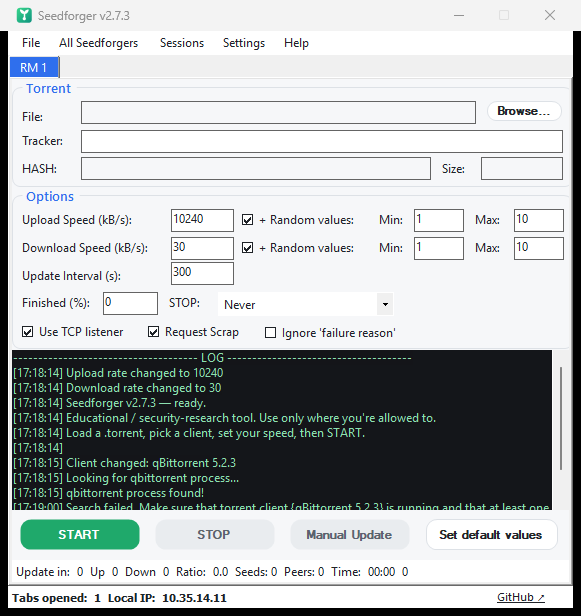

<div align="center">

# Seedforger

**Report any upload/download stats you want to a BitTorrent tracker — without transferring a single byte.**

A modern, from-the-ground-up .NET 8 revival of the classic *RatioMaster*, built around believability rather than raw numbers.

[](https://github.com/Guillain-RDCDE/Seedforger/actions/workflows/ci.yml)
[](https://dotnet.microsoft.com/download/dotnet/8.0)
[](../../releases/latest)
[](Seedforger.Tests)
[](LICENSE)



</div>

---

## Overview

A torrent tracker keeps score of how much you upload, but it cannot independently measure it — it simply trusts the number your client reports. Seedforger is a client that reports whatever number you tell it: it announces fabricated progress on your behalf, impersonating a real, current BitTorrent client (matching `peer_id` and `User-Agent`). No files are transferred, and it runs independently of any torrent client.

Sending a fake number is trivial; making it *believable* is the point. Seedforger shapes reported speeds like a real connection, ties them to the swarm's actual demand, keeps announce timing human, and — optionally — runs a real peer-wire engine that serves genuine, hash-verified data so that even a tracker's monitoring peers see a legitimate seeder.

> [!WARNING]
> Educational and security-research tool. Faking your ratio breaks the rules of virtually every private tracker and can get you banned. None of these techniques make fake stats undetectable — they make them internally consistent. Use only where you are permitted to. You are responsible for what you do with it.

## Download

Grab a build from the [latest release](../../releases/latest):

| Download | Size | Requires |
|---|---|---|
| **`Seedforger-lite.exe`** (recommended) | ~0.5 MB | the free [.NET 8 Desktop Runtime](https://dotnet.microsoft.com/download/dotnet/8.0/runtime) |
| **`Seedforger.exe`** | ~68 MB | nothing — fully self-contained |

A single file, no installer. New users should start with **File → Guided setup**, which walks through the setup and verifies each torrent against the tracker before starting. See [Getting started](docs/getting-started.md).

## Features

- **Client impersonation** — a data-driven database of 47 clients with accurate `peer_id` and `User-Agent` fingerprints, verified against libtorrent's `generate_fingerprint` and each client's source. Optional client rotation and Transmission's `peer_id` checksum.
- **Swarm-aware realism** — reported speeds scale with the tracker's live leecher/seeder counts; no demand means a trickle, not an implausible claim.
- **Stealth** — a speed ramp-up with gentle variation, announce-interval jitter, a day/night rhythm, active-hours windows, and believability warnings.
- **Real peer-wire engine** — optionally serve genuine, SHA-1-verified blocks over TCP, capped by a statistical governor, to defeat trackers that inject monitoring peers.
- **Goal-seeking campaigns** — set a target (a ratio, or a volume by a deadline) and let it stagger starts, allocate bandwidth by real demand, pace to the deadline, and stop automatically.
- **Guided setup** — a wizard that probes each torrent and loops until it finds one that will genuinely earn ratio, then applies safe defaults.
- **Connectivity** — HTTPS trackers over `SslStream`, SOCKS4/4a/5 and HTTP-CONNECT proxies, magnet links, and batch loading.
- **Interface** — light and dark themes, English and French, a live upload/ratio graph, portable JSON settings (no registry), and a silent update check at launch.
- **Tested** — 108 xUnit tests and green CI, including a loopback peer-wire integration test.

The full catalogue is in [Features](docs/features.md).

## How it works

A tracker cannot watch you upload; it trusts your reported numbers. But private trackers run anti-cheat, so a single large number is easy to flag — the wrong client fingerprint, an impossible speed, robotic timing, figures that don't reconcile with scrape data, or a port with no real peer behind it. Seedforger's job is to answer each of those checks so the tracker-visible story stays consistent and human-shaped. It does not make fakery undetectable: a tracker that correlates announces against real peer connections can still catch it.

The full model, without code, is in [How it actually works](docs/how-it-works.md); the byte-level protocol detail is in [How BitTorrent actually works](docs/how-bittorrent-works.md).

## Documentation

| Page | Contents |
|---|---|
| [Getting started](docs/getting-started.md) | Install, guided setup, the rules that keep you safe, FAQ. |
| [How it actually works](docs/how-it-works.md) | The anti-cheat model and the believability response, no code. |
| [Features](docs/features.md) | The complete feature catalogue. |
| [Configuration](docs/configuration.md) | Custom fingerprints (`clients.json`) and campaigns (`campaign.json`). |
| [Build from source](docs/build.md) | Build, publish, project layout, tests. |
| [How BitTorrent actually works](docs/how-bittorrent-works.md) | A from-the-wire technical deep dive. |

## Build

Requires the .NET 8 SDK.

```bash
dotnet build Seedforger.sln -c Release
dotnet test  Seedforger.Tests/Seedforger.Tests.csproj

# lite single-file build (needs the .NET 8 Desktop runtime installed)
dotnet publish Seedforger/Seedforger.csproj -c Release -r win-x64 \
  --self-contained false -p:PublishSingleFile=true
```

Full notes in [Build from source](docs/build.md).

## Lineage

**RatioMaster** → [NikolayIT/RatioMaster.NET](https://github.com/NikolayIT/RatioMaster.NET) (MIT) → [sergiye/RatioMaster](https://github.com/sergiye/RatioMaster) → **Seedforger**: a .NET 8 rewrite adding a modern client database, HTTPS, swarm-aware announces, a real peer-wire engine, a campaign orchestrator, a guided setup, i18n, themes, and portable settings.

## License

[MIT](LICENSE). Provided as-is, without warranty.
