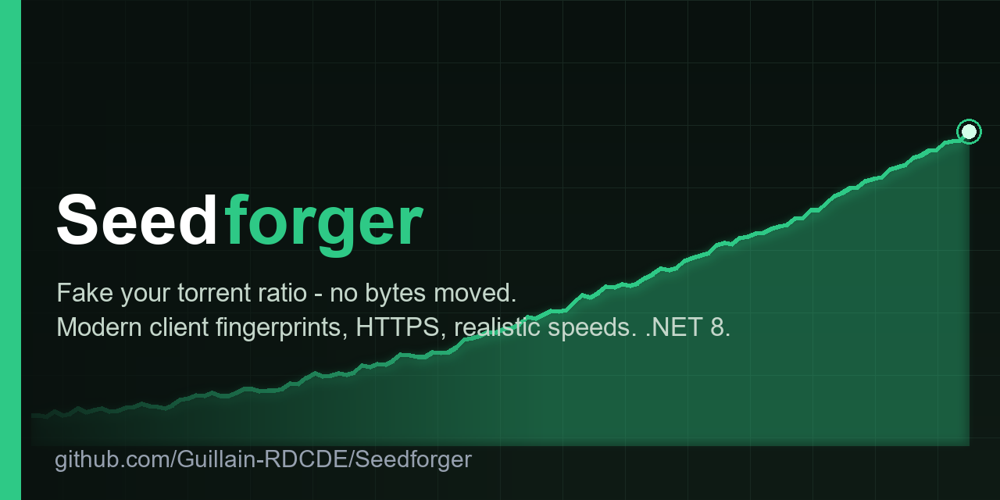
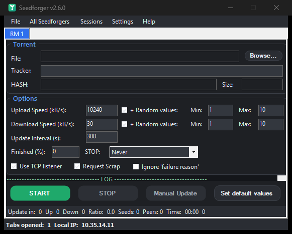
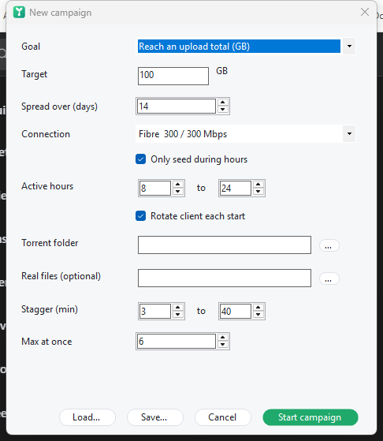

<div align="center">

# 🌱 Seedforger

**Tell any BitTorrent tracker whatever upload/download stats you want — without moving a single byte.**

A modern, from-the-ground-up **.NET 8** revival of the classic *RatioMaster* — rebuilt as a believability engine, not just a number generator.



[](https://github.com/Guillain-RDCDE/Seedforger/actions/workflows/ci.yml)
[](https://dotnet.microsoft.com/download/dotnet/8.0)
[](../../releases/latest)
[](LICENSE)
[](Seedforger.Tests)

<table>
  <tr>
    <td></td>
    <td></td>
  </tr>
  <tr>
    <td align="center"><em>Dark theme — one tab per torrent</em></td>
    <td align="center"><em>Light theme — same, your choice</em></td>
  </tr>
  <tr>
    <td colspan="2" align="center"></td>
  </tr>
  <tr>
    <td colspan="2" align="center"><em>Visual campaign builder — set a goal, no JSON</em></td>
  </tr>
</table>

</div>

---

Seedforger connects to a torrent tracker and **announces fake progress** (uploaded / downloaded / left) on your behalf. It impersonates a **real, current BitTorrent client** — matching `peer_id` and `User-Agent` fingerprints — so the announce looks exactly like the real thing. No files are ever transferred; only the numbers the tracker sees are made up.

It works **independently of your torrent client** — you don't even need one installed.

But the interesting part isn't sending a fake number — anyone can do that, and it gets you banned. The interesting part is making the number **believable**: shaping speeds like a real line, tying them to the swarm's real demand, keeping announce timing human, staying under a statistical governor, and — if you want to go all the way — running a **real peer-wire engine that serves genuine, hash-verified data** so that even a tracker's monitoring spies see a legitimate peer. That's what this project is really about.

> [!WARNING]
> **This is an educational / security-research tool.** Faking your ratio breaks the rules of virtually every private tracker and **will get you banned** if you're caught. None of the techniques here make fake stats *undetectable*. Only use it where you are allowed to. You alone are responsible for what you do with it.

### Contents
- [🌱 For everyone — the 60-second guide](#-for-everyone--the-60-second-guide)
- [🧭 How it actually works (no code)](#-how-it-actually-works-no-code)
- [🔧 For power users & developers](#-for-power-users--developers)
  - [Feature catalogue](#feature-catalogue)
  - [`clients.json` — custom fingerprints](#custom--updated-fingerprints-without-rebuilding)
  - [Campaigns & `campaign.json`](#campaigns-goal-seeking-orchestrator)
  - [Build & publish](#build-from-source)
- [📖 Go deeper — the from-the-wire guide](#-go-deeper)
- [Credits & lineage](#credits--lineage)

---

## 🌱 For everyone — the 60-second guide

**In plain words:** a torrent tracker keeps score of how much you upload — but it can't actually *watch* you upload. It just believes the number your client reports. Seedforger is a client that reports whatever number you tell it. You give it a `.torrent` file and say *"pretend I'm seeding at 10 MB/s"*, and it quietly tells the tracker that story, over and over, so your stats climb. That's the whole idea.

### Get it running
Grab a build from the [latest release](../../releases/latest) — pick the one that suits you:

| Download | Size | Starts up | Needs |
|---|---|---|---|
| ⭐ **`Seedforger-lite.exe`** *(recommended)* | ~0.5 MB | **fastest** | the free [.NET 8 Desktop Runtime](https://dotnet.microsoft.com/download/dotnet/8.0/runtime) (one-time install) |
| **`Seedforger.exe`** | ~68 MB | slower to launch | **nothing at all** — fully self-contained |

Either way it's a **single file, no installer**, that you can drop anywhere (USB stick included). Double-click and go.

> **Why two?** The self-contained build carries the whole .NET runtime inside it, so it's big and your antivirus rescans all 68 MB on every launch — that's what makes it feel slow. The lite build is a tiny 0.5 MB and starts roughly twice as fast; it just asks you to install the .NET runtime once. If you're not sure whether you have .NET, download lite first — Windows will tell you (and hand you the installer) if it's missing.

### Use it
1. **Browse…** and pick your `.torrent` file.
2. Set the **Upload Speed** (in kB/s) — how fast you want to "seed".
3. Choose a **Client** to impersonate — **qBittorrent 5.2.3** is a great, modern default.
4. Hit the green **START** button. Watch the **Ratio** and the log update.
5. Hit the red **STOP** when you're done.

### The golden rule: stay believable
Trackers run anti-cheat. The fastest way to get banned is to be *implausible*. Seedforger gives you the tools to avoid that — use them:

- **Keep speeds realistic.** Announcing that you seeded 900 GB in ten minutes is a great way to get flagged. One click: **Settings → Connection profile** (ADSL, VDSL, fibre, cable, 4G, 5G…) fills in speeds that look like a normal home line.
- **Leave *Realistic speed (ramp-up)* on** (Settings menu) — your fake speed climbs and wobbles like a real client instead of a robotic flat line.
- **Use a current client** (qBittorrent, Transmission 4, Deluge 2). Old clients stand out on a whitelist.
- **Don't seed to an empty swarm at full tilt.** With *Swarm-aware speeds* on, Seedforger already trickles when nobody's there to download from you.
- **Let a campaign pace you.** Instead of babysitting tabs, tell the [campaign builder](#campaigns-goal-seeking-orchestrator) a goal ("reach ratio 2.0 over two weeks") and it spreads the work out for you.

### Newbie FAQ
- **Do I need a torrent client running?** No. Seedforger talks to the tracker by itself.
- **Does it actually upload my files?** No — by default it transfers *nothing*; it only reports numbers. (There's an advanced mode that serves real data — see below — but it's opt-in.)
- **Will this make me undetectable?** **No.** It makes your story *consistent and human-shaped*. A determined tracker can still catch fakery. Treat it as a game / learning tool.
- **Windows only?** Yes — it's a WinForms app for Windows.

---

## 🧭 How it actually works (no code)

You don't need to read the protocol spec to get the shape of it.

**1. The tracker trusts you.** When a real client seeds, every few minutes it sends the tracker a little report: *"I'm client X, I've now uploaded N bytes on this torrent."* The tracker has **no way to independently measure** your upload — it simply adds up the numbers you send. That trust is the entire attack surface, and it's why ratio faking is possible at all.

**2. So why can't you just send a huge number?** Because private trackers run **anti-cheat**, and a lone big number is easy to spot:

| The tracker asks… | …and a naïve faker fails because |
|---|---|
| *Is this a real, allowed client?* | its `peer_id`/`User-Agent` isn't on the whitelist, or they disagree |
| *Is this speed physically possible?* | it "uploaded" faster than any home line, or more than the file's total size |
| *Is the timing human?* | it announces like a metronome, or more often than allowed |
| *Do the numbers add up?* | announce totals don't match the scrape data or the `left` value |
| *Is there a real peer behind this?* | the port never accepts a connection; no monitored peer ever got a byte |

**3. Seedforger's job is to pass every one of those checks.** It layers believability, from cheap to deep:

- **Look like a real client** → accurate, *current* fingerprints (`-qB5230-`, `-TR4130-`, …), optional **client rotation**, even client-specific quirks like Transmission's `peer_id` checksum.
- **Move at a believable speed** → **connection profiles** (ADSL→fibre) set sane limits, a **ramp-up + gentle wobble** replaces the flat line, and a **global upstream budget** makes all your tabs share one uplink like they'd share one real connection.
- **Only feed demand that exists** → **swarm-aware speeds** read the tracker's live leecher/seeder counts. Zero leechers → you trickle (nobody to feed). Lots of competing seeders → your share is diluted. The physics line up.
- **Keep timing human** → **interval jitter** (drift *later*, never earlier than the tracker allows), a **day/night rhythm**, and an **active-hours** window so you're not seeding at 4 a.m. every night forever.
- **Be a connectable peer** → answer inbound handshakes on your port with a full **bitfield + choke**: a visible, complete seeder that happens to transfer nothing.
- **Survive active spies (the deep end)** → a tracker can inject **monitoring peers** that *request* real blocks and check you deliver. The only real answer is to **serve genuine, hash-valid data**. Seedforger can — with a real TCP peer-wire engine — and then leans on one elegant fact: *a spy only sees its own connection.* Serve real data at a steady per-peer rate, and claim a total of `served × plausible peers`; no single observer can refute it. Past this point, "faking convincingly" quietly converges on "being a real, lazy BitTorrent client" — which is the honest note the whole exercise ends on.

**4. The honest limit.** None of this is magic. A tracker that correlates announces against *actual* peer-to-peer connections, or demands client-side checksums, can still catch you. Seedforger makes the tracker-visible story internally consistent and human-shaped — no more, no less.

> Want the bytes, not the metaphor? The [from-the-wire guide](docs/how-bittorrent-works.md) explains every layer above down to the handshake.

---

## 🔧 For power users & developers

### 📖 First, the deep-dive
**[How BitTorrent actually works](docs/how-bittorrent-works.md)** — a from-the-wire technical guide: bencode, the `.torrent` file, the infohash, peer-ID encodings, the tracker & peer-wire protocols, DHT/PEX/magnets, encryption, how ratio is measured, the full anti-cheat model, and exactly where Seedforger plugs in (including §13½, the real peer engine). Written for people who want the bytes.

### Feature catalogue

<details open>
<summary><strong>🎭 Realistic client impersonation</strong></summary>

| | |
|---|---|
| **Client database** | Data-driven profiles (**47 clients**), not a hard-coded switch. Add or override any client via an external `clients.json` — **no recompile**. |
| **Modern fingerprints** | qBittorrent `-qB`, Transmission `-TR`, Deluge `-DE`, libtorrent `-LT`, µTorrent, plus the whole legacy zoo. Verified against libtorrent's `generate_fingerprint` and each client's source. |
| **peer_id fidelity** | Reproduces client-specific quirks, including **Transmission's peer_id checksum**, so ids validate byte-for-byte. |
| **Client rotation** | Optionally pick a fresh modern client on every start, so you don't always look like the same machine. |
| **Byte-accurate HTTP** | Header order and `User-Agent` are hand-built to match the impersonated client exactly — including over TLS. |

</details>

<details>
<summary><strong>🕵️ Believability & stealth</strong></summary>

| | |
|---|---|
| **Realistic announces** | `SpeedShaper` applies a ramp-up + mean-reverting random walk instead of flat noise, so reported speeds look human. |
| **Interval jitter** | Announce timing drifts *later* (0–12%), never earlier than the tracker's `interval` — no metronome. |
| **Day/night rhythm + active hours** | A diurnal speed curve plus an optional active-hours window (handles the midnight wrap, e.g. `22–6`). |
| **Believability warnings** | Logs a warning at START on physically implausible setups (absurd upstream, upload ≫ download). |
| **Connectable seeder** | Answers inbound handshakes on your port with a full **bitfield then a choke** — a connectable, complete seeder that transfers nothing. |

</details>

<details>
<summary><strong>🌊 Swarm-aware realism</strong></summary>

| | |
|---|---|
| **Swarm-aware speeds** | Upload/download scaled by the tracker's **real leecher/seeder counts** — 0 leechers ⇒ a trickle, your share diluted by competing seeders. Makes the numbers physically plausible. |
| **Global upstream budget** | A connection profile caps your **total** upload across *all* tabs — one uplink, shared fairly, like a real line. |
| **Statistical governor** | In real-seed mode, the announced upload is capped to `served × plausible peers` — you never claim more than you could defend. |

</details>

<details>
<summary><strong>🔬 The real peer-wire engine (advanced)</strong></summary>

*File → Serve a real file* arms a genuine TCP **peer-wire engine** — the answer to trackers that inject monitoring peers which *request-and-verify*. See the [deep-dive §13½](docs/how-bittorrent-works.md#13-the-deep-end-actually-participating-in-the-swarm).

| Stage | What it does |
|---|---|
| **A — serve from a local file** | `FilePieceSource` reads blocks and **verifies each piece's SHA-1** before serving; `PeerSession` runs handshake → bitfield → unchoke → `piece`. |
| **B — relay on demand** | `RelayPieceSource` serves pieces you don't hold by fetching them from a real seeder, verifying, caching, relaying — a swarm proxy that stores no whole file. |
| **C — behave like a real peer** | `SeederChoke` round-robins unchoke slots; the **BEP 10** extension handshake advertises `ut_pex` / `ut_metadata`. |
| **D — verifiable transfer** | `PeerClient` performs a real handshake + block download + hash-verify — the thing a spy actually measures. |
| **The governor** | `Governor.CapAnnounced` keeps the claim ≤ what was actually served × a plausible peer count. |

> Scope: **TCP-only** (no µTP), PEX/metadata are built but not live-negotiated, validated over loopback — not against live swarms.

</details>

<details>
<summary><strong>🎯 Campaign orchestration</strong></summary>

| | |
|---|---|
| **Goal-seeking campaigns** | Give it an intent — *reach ratio 2.0* or *upload 200 GB by a deadline* — and it derives the actions over time. |
| **Visual builder** | *File → New campaign…* opens a themed form: goal, connection profile, active hours, torrent folder, stagger, concurrency. **No JSON by hand.** |
| **Human pacing** | **Staggered** starts (launching everything at once is a tell), upstream **budget split by real demand**, **pacing** so you don't finish suspiciously early, then **auto-stop** at the goal. |

</details>

<details>
<summary><strong>🔌 Connectivity & inputs</strong></summary>

| | |
|---|---|
| **HTTPS trackers** | Full TLS via `SslStream`, sending a raw hand-built request so header order / User-Agent stay byte-accurate. |
| **Proxy** | SOCKS4 / 4a / 5 and HTTP-CONNECT for HTTP trackers. |
| **Magnet & batch** | Open **magnet links** (infohash-only) and load a whole folder of `.torrent`s into tabs at once. |
| **Auto-stop targets** | Stop on time, uploaded, downloaded, **ratio**, or seeders/leechers. |
| **Dry-run** | *File → Test announce* sends a single announce and shows whether the tracker accepted it — before you commit. |

</details>

<details>
<summary><strong>🎨 Experience</strong></summary>

| | |
|---|---|
| **Light & dark themes** | Follows your OS on first launch (dark title bar via DWM); toggle in Settings. Owner-drawn flat cards + pill buttons. |
| **English / French** | Full in-app localization, switchable at runtime. |
| **Live graph** | *File → Live graph* — a dashboard tracing cumulative upload + ratio for the active tab. |
| **Portable settings** | Everything lives in `settings.json` next to the exe. **No registry**, fully portable (USB-friendly). |

</details>

#### Emulated clients (built-in)
qBittorrent · Transmission · Deluge · libtorrent · µTorrent · BitTorrent · BitComet · Vuze · Azureus · BitLord · ABC · BTuga · BitTornado · Burst · BitTyrant · BitSpirit · KTorrent · Gnome BT — several versions each, 47 profiles in all.

### Custom / updated fingerprints without rebuilding
On first launch Seedforger drops a **`clients.sample.json`** next to the exe. Copy it to **`clients.json`**, edit, done — entries are merged by name (yours override the built-ins), so you can add tomorrow's qBittorrent the day it ships:

```json
[
  {
    "family": "qBittorrent",
    "version": "5.2.3",
    "httpProtocol": "HTTP/1.1",
    "hashUpperCase": false,
    "key": { "type": "hex", "length": 8, "urlEncode": false, "upperCase": true },
    "peerIdPrefix": "-qB5230-",
    "peerIdRandom": { "type": "random", "length": 12, "urlEncode": true, "upperCase": false },
    "headers": "Host: {host}\r\nUser-Agent: qBittorrent/5.2.3\r\nAccept-Encoding: gzip\r\nConnection: close\r\n",
    "query": "info_hash={infohash}&peer_id={peerid}&port={port}&uploaded={uploaded}&downloaded={downloaded}&left={left}&corrupt=0&key={key}{event}&numwant={numwant}&compact=1&no_peer_id=1&supportcrypto=1&redundant=0",
    "defNumWant": 200,
    "parse": true,
    "searchString": "&peer_id=-qB5230-",
    "processName": "qbittorrent",
    "startOffset": 0,
    "maxOffset": 200000000
  }
]
```

### Campaigns (goal-seeking orchestrator)
*File → **New campaign…*** opens the [visual builder](docs/screenshots/campaign-builder.png) — pick a goal (ratio / GB by a deadline), a connection profile, active hours, a torrent folder, and hit **Start** (or Save / Load). No JSON to hand-write.

Under the hood it's a `campaign.json` (Save/Load in the dialog; a `campaign.sample.json` is dropped next to the exe):

```json
{
  "Goal": "upload",                 // or "ratio"
  "UploadGoalGB": 200,
  "TargetRatio": 2.0,
  "DeadlineHours": 336,             // spread over ~2 weeks (0 = as fast as credible)
  "Connection": "Fibre  300 / 300 Mbps",
  "UseActiveHours": true, "ActiveHoursStart": 8, "ActiveHoursEnd": 24,
  "RotateClient": true,
  "TorrentFolder": "C:\\torrents",
  "RealFileFolder": "",            // optional: matching files to seed for real
  "StaggerMinMinutes": 3, "StaggerMaxMinutes": 40, "MaxConcurrent": 6
}
```

The orchestrator staggers the starts, splits the connection's upstream toward the torrents that actually have leechers, paces the total toward the deadline, and stops at the goal — because launching everything at once, flat out, is exactly what a bot looks like.

### Build from source
Requires the **.NET 8 SDK** (`dotnet --version` ≥ 8).

```bash
# build
dotnet build Seedforger.sln -c Release

# run the tests (xUnit) — 108 of them
dotnet test Seedforger.Tests/Seedforger.Tests.csproj

# lite single-file exe — tiny & fast (needs the .NET 8 Desktop runtime installed)
dotnet publish Seedforger/Seedforger.csproj -c Release -r win-x64 --self-contained false -p:PublishSingleFile=true

# self-contained single-file exe — bundles the runtime, needs nothing installed
dotnet publish Seedforger/Seedforger.csproj -c Release -r win-x64 --self-contained true \
  -p:PublishSingleFile=true -p:EnableCompressionInSingleFile=true
```

> **Startup tip:** don't reach for `-p:PublishReadyToRun=true` on the self-contained build — it more than doubles the file size (≈170 MB), and the extra bytes your antivirus has to rescan on every launch cost *more* startup time than R2R saves. Measured here, the compressed self-contained build (≈12 s to window) beats the R2R one (≈22 s), and the lite build (≈6 s) beats both. **Size, not JIT, dominates startup.**

### Project layout
```
Seedforger/
├─ Program.cs                 entry point, single-instance, code-page provider
├─ TorrentClientFactory.cs    data-driven client lookup + clients.json merge
├─ DefaultClientProfiles.cs   the 47 built-in client profiles
├─ ClientProfile.cs           profile model (peer_id recipe, headers, query, …)
├─ SpeedShaper.cs             realistic ramp-up / speed variation
├─ Stealth.cs · SwarmModel.cs · Bandwidth.cs   believability + swarm + budget
├─ HttpsTransport.cs          TLS transport for https:// trackers
├─ Settings.cs                portable JSON settings store
├─ Theme.cs · Localization.cs · GraphForm.cs   themes, i18n, live graph
├─ Peer/                      the real peer-wire engine (stages A–D + governor)
├─ Campaign/                  orchestrator + visual builder (CampaignForm)
├─ BitTorrent/                bencode + .torrent parsing
├─ BytesRoads/                SOCKS / HTTP-CONNECT proxy sockets
└─ RM.cs / MainForm.cs        the WinForms UI
Seedforger.Tests/             108 xUnit tests
docs/how-bittorrent-works.md  the from-the-wire deep-dive
```

### Tests
**108 xUnit tests** cover the client fingerprints (incl. Transmission checksum), bencode round-trips, the speed shaper, stealth/swarm/bandwidth math, the peer-wire protocol and a **loopback integration test** (one node downloads a hash-valid piece from another), the campaign planner, JSON settings/clients round-trips, and the HTTPS transport (a real TLS fetch, skipped gracefully offline).

### Contributing
PRs welcome — especially **new / updated client fingerprints** (`DefaultClientProfiles.cs`) and tracker-compatibility fixes. Keep fingerprints accurate: a wrong `peer_id` gets *users* banned.

---

## 📖 Go deeper

The **[from-the-wire technical guide](docs/how-bittorrent-works.md)** is the companion to this README — 14 sections from bencode to the real peer engine:

> The big picture · Bencoding · The `.torrent` file · The infohash · Peer IDs · The tracker protocol (HTTP/UDP) · Compact peers · The peer wire protocol · DHT/PEX/LSD · Magnet links · Encryption (MSE/PE) · How ratio is computed · Where Seedforger sits · **§13½ — actually participating in the swarm**

---

## Credits & lineage

Seedforger stands on a long open-source lineage:
**RatioMaster** → [NikolayIT/RatioMaster.NET](https://github.com/NikolayIT/RatioMaster.NET) (MIT) → [sergiye/RatioMaster](https://github.com/sergiye/RatioMaster) → **Seedforger** — a .NET 8 rewrite that adds a modern client database, HTTPS, realistic/swarm-aware announces, a real peer-wire engine, a goal-seeking campaign orchestrator, i18n, themes, portable settings, and a redesigned UI.

## License

[MIT](LICENSE). Provided **as-is**, with no warranty. Do the right thing.
