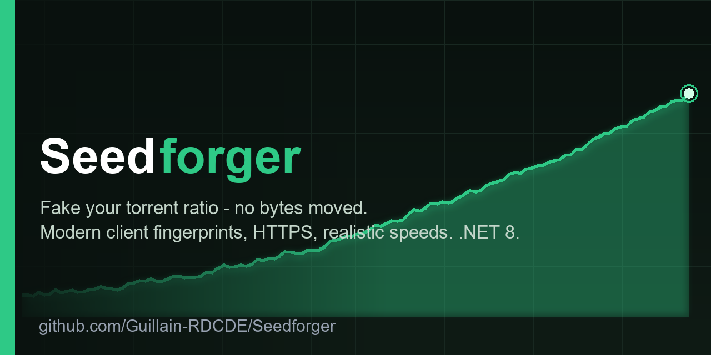
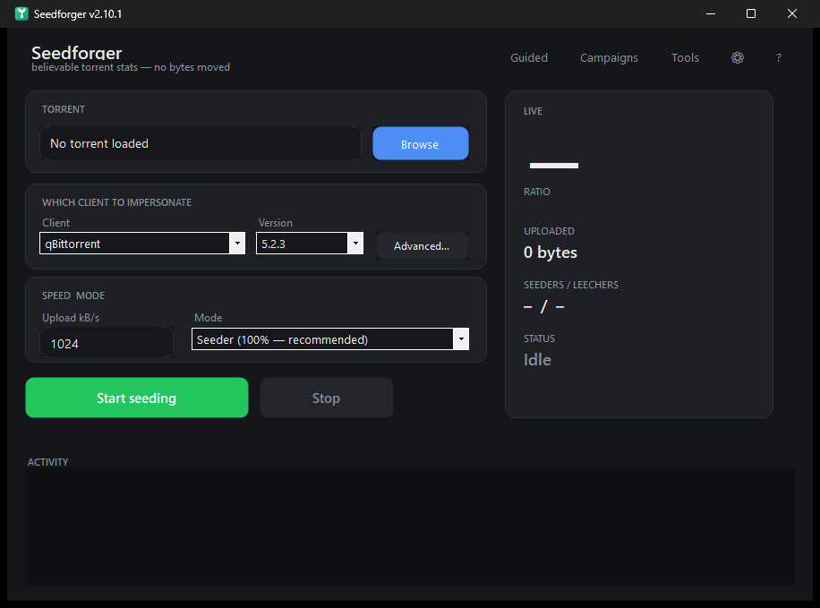

<div align="center">



# Seedforger

### Fake your BitTorrent upload/download stats on any tracker — the most complete ratio spoofer we could build, shipped with the proof it can't actually win.

A modern **.NET 8** revival of RatioMaster: it tells a tracker you uploaded gigabytes while transferring nothing, impersonating a real client down to the last byte. And — in the same repository — the reproducible science showing why the client side is a game you cannot win.

[](https://github.com/Guillain-RDCDE/Seedforger/actions/workflows/ci.yml)
[](https://dotnet.microsoft.com/download/dotnet/8.0)
[](../../releases/latest)
[](tests/Seedforger.Tests)
[](../../releases/latest)
[](LICENSE)

<br>

[](../../releases/latest) &nbsp;
[](docs/getting-started.md) &nbsp;
[](https://guillain-rdcde.github.io/Seedforger/)



</div>

---

## What it is

A tracker can't watch you upload — it trusts the numbers your client reports. Seedforger reports **fabricated** ones. It announces invented upload/download to a tracker while transferring nothing, impersonating a real, current client down to the `peer_id` and `User-Agent`, and shaping speed and timing so the whole story stays believable to anti-cheat.

It's also **honest about its own limits**: shipped alongside the client is a small, reproducible research annex — two short papers and a runnable model — that proves, formally, that even a *perfect* version of this client is capped. A tracker doesn't *trust* your number, it *reconciles* it; once you write that reconciliation down as maths, no amount of client polish beats it.

So you get both: a genuinely serious ratio spoofer, **and** the proof of why the honest move is to actually seed. Use the first; believe the second.

> [!WARNING]
> **Educational and security-research artifact.** Faking your ratio breaks the rules of virtually every private tracker and can get you banned. Nothing here makes fake stats *undetectable* — the whole conclusion is the opposite. Use only where you are permitted to. **You are responsible for what you do with it.**

## Run it in 30 seconds

No installer — a single file. Grab the build for your platform from the [**latest release**](../../releases/latest):

| Platform | Download | Requires |
|---|---|---|
| **Windows** (recommended) | `Seedforger-lite-win-x64.exe` &nbsp;·&nbsp; ~0.5 MB | the free [.NET 8 Desktop Runtime](https://dotnet.microsoft.com/download/dotnet/8.0/runtime) |
| **Windows** (portable) | `Seedforger-win-x64.exe` &nbsp;·&nbsp; ~24 MB | nothing — fully self-contained |
| **Linux / macOS** | `Seedforger-gui-*` (GUI) · `Seedforger-cli-*` (headless) | nothing — self-contained |

The **graphical app** and a **headless command line** drive the same engine:

```bash
# Dry-run one announce and print exactly what the tracker says back
./Seedforger.Cli --test-announce -t movie.torrent --client qBittorrent
```

New to this? The [**guided setup**](docs/getting-started.md) probes each torrent and walks you to one that will genuinely earn ratio, with safe defaults.

## More

**[Reference](docs/REFERENCE.md)** — what it does in detail, the *No Free Ratio* science annex, the documentation index, and how to build it.

## Lineage

**RatioMaster** → [NikolayIT/RatioMaster.NET](https://github.com/NikolayIT/RatioMaster.NET) (MIT) → [sergiye/RatioMaster](https://github.com/sergiye/RatioMaster) → **Seedforger**: a .NET 8 rewrite that took the old idea as far as it could go — a modern client database, HTTPS, swarm-aware announces, a real peer-wire engine, campaigns, guided setup, i18n, portable settings — and then answered the question the old tools never asked, with a formal science annex.

## License

[MIT](LICENSE). Provided as-is, without warranty.
