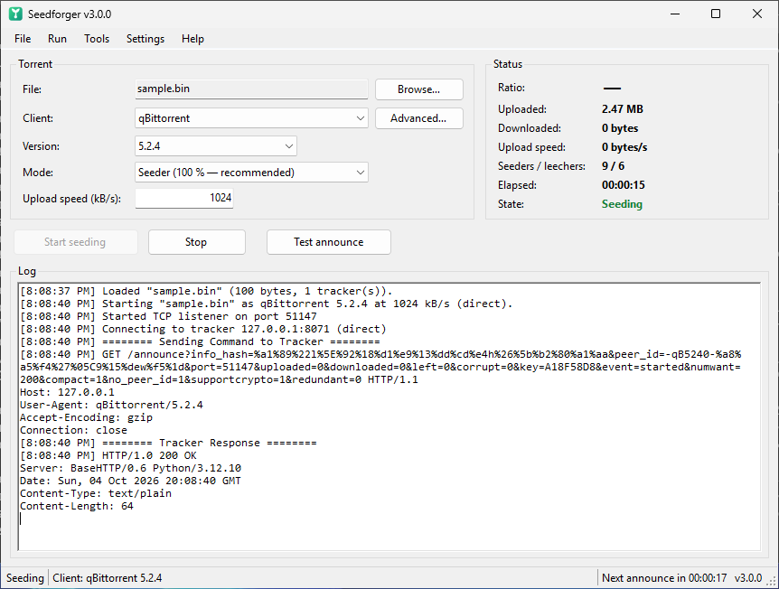

# Features

[← back to the README](../README.md)

For *why* these matter, read [How it actually works](how-it-works.md); for the protocol detail, the [from-the-wire deep dive](how-bittorrent-works.md).

---

## 🎭 Realistic client impersonation

| | |
|---|---|
| **Client database** | Data-driven profiles (**57 clients**, refreshed October 2026), not a hard-coded switch. Add or override any client via an external [`clients.json`](configuration.md#custom--updated-fingerprints-without-rebuilding) — **no recompile**. |
| **Modern fingerprints** | qBittorrent 5.2.4 `-qB`, Transmission 4.1.3 `-TR`, Deluge 2.2.0 `-DE`, libtorrent 2.1.2 / 2.0.15 `-LT`, BiglyBT 4.1 `-BI`, µTorrent 3.6 `-UT`, BitComet 2.22 `-BC`, plus the whole legacy zoo. Verified against libtorrent's `generate_fingerprint` and each client's source. |
| **peer_id fidelity** | Reproduces client-specific quirks, including **Transmission's peer_id checksum**, so ids validate byte-for-byte. |
| **Client rotation** | Optionally pick a fresh modern client on every start, so you don't always look like the same machine. |
| **Byte-accurate HTTP** | Header order and `User-Agent` are hand-built to match the impersonated client exactly — including over TLS. |

## 🕵️ Believability & stealth

| | |
|---|---|
| **Realistic announces** | `SpeedShaper` applies a ramp-up + mean-reverting random walk instead of flat noise, so reported speeds look human. |
| **Interval jitter** | Announce timing drifts *later* (0–12%), never earlier than the tracker's `interval` — no metronome. |
| **`min interval` floor** | Reads the tracker's `min interval` and never re-announces sooner than it — the exact rule real clients obey. |
| **`completed` lifecycle** | A leecher that reaches `left=0` fires a single `event=completed` and switches to a seeder, then never repeats it — like a real client finishing a download. |
| **Multi-tracker (BEP-12)** | Announces to every tracker the torrent lists (the `announce-list` tiers, de-duplicated); the primary drives the reported swarm. |
| **Day/night rhythm + active hours** | A diurnal speed curve plus an optional active-hours window (handles the midnight wrap, e.g. `22–6`). |
| **Believability warnings** | Logs a warning at START on physically implausible setups (absurd upstream, upload ≫ download). |
| **Connectable seeder** | Answers inbound handshakes on your port with a full **bitfield then a choke** — a connectable, complete seeder that transfers nothing. |

## 🌊 Swarm-aware realism

| | |
|---|---|
| **Swarm-aware speeds** | Upload/download scaled by the tracker's **real leecher/seeder counts** — 0 leechers ⇒ a trickle, your share diluted by competing seeders. Makes the numbers physically plausible. |
| **Global upstream budget** | A connection profile caps your **total** upload across *all* tabs — one uplink, shared fairly, like a real line. |
| **Statistical governor** | In real-seed mode, the announced upload is capped to `served × plausible peers` — you never claim more than you could defend. |

## 🔬 The real peer-wire engine (advanced)

*Run → Serve a real file* arms a genuine TCP **peer-wire engine** — the answer to trackers that inject monitoring peers which *request-and-verify*. See the [deep-dive §13½](how-bittorrent-works.md#deep-end).

| Stage | What it does |
|---|---|
| **A — serve from a local file** | `FilePieceSource` reads blocks and **verifies each piece's SHA-1** before serving; `PeerSession` runs handshake → bitfield → unchoke → `piece`. |
| **B — relay on demand** | `RelayPieceSource` serves pieces you don't hold by fetching them from a real seeder, verifying, caching, relaying — a swarm proxy that stores no whole file. |
| **C — behave like a real peer** | `SeederChoke` round-robins unchoke slots; the **BEP 10** extension handshake advertises `ut_pex` / `ut_metadata`. |
| **D — verifiable transfer** | `PeerClient` performs a real handshake + block download + hash-verify — the thing a spy actually measures. |
| **The governor** | `Governor.CapAnnounced` keeps the claim ≤ what was actually served × a plausible peer count. |

> Scope: **TCP-only** (no µTP), PEX/metadata are built but not live-negotiated, validated over loopback — not against live swarms.

## 🎯 Campaign orchestration

| | |
|---|---|
| **Goal-seeking campaigns** | Give it an intent — *reach ratio 2.0* or *upload 200 GB by a deadline* — and it derives the actions over time. |
| **Visual builder** | *Tools → Campaigns…* opens a plain form: goal, connection profile, active hours, torrent folder, stagger, concurrency. **No JSON by hand.** |
| **Human pacing** | **Staggered** starts (launching everything at once is a tell), upstream **budget split by real demand**, **pacing** so you don't finish suspiciously early, then **auto-stop** at the goal. |

See [Configuration → Campaigns](configuration.md#campaigns-goal-seeking-orchestrator) for the `campaign.json` format.

## 🖥️ Headless daemon & web dashboard

*Run it 24/7 on a seedbox or NAS.* See [Daemon & web dashboard](daemon.md).

| | |
|---|---|
| **Daemon mode** | `--daemon` (or `--folder`) runs one torrent or a whole folder headless, holding the process until Ctrl+C, a duration, or the dashboard's Stop button. |
| **Live web dashboard** | A single self-contained dark page (built-in `HttpListener`, no assets) shows total upload / ratio / active count and a per-torrent table (client, ratio, live seeders/leechers, interval, `real seed` badge), refreshing every 2 s. |
| **JSON API** | `GET /api/status` returns the whole snapshot to script against; `POST /api/stop` halts everything. |
| **Bind & port** | Localhost by default; `--web-bind 0.0.0.0 --web-port N` to reach it across the LAN (or over an SSH tunnel). |

## 🔌 Connectivity & inputs

| | |
|---|---|
| **HTTPS trackers** | Full TLS via `SslStream`, sending a raw hand-built request so header order / User-Agent stay byte-accurate. |
| **Proxy** | SOCKS4 / 4a / 5 and HTTP-CONNECT for HTTP trackers. |
| **Magnet & batch** | Open **magnet links** (infohash-only) and load a whole folder of `.torrent`s into tabs at once. |
| **Auto-stop targets** | Stop on time, uploaded, downloaded, **ratio**, or seeders/leechers. |
| **Dry-run** | *Run → Test announce* (or the **Test announce** button, F7) sends a single announce and shows whether the tracker accepted it — before you commit. |

## 🎨 Experience

| | |
|---|---|
| **Guided setup (newbie mode)** | A step-by-step wizard that probes each torrent against the tracker — accepted? enough leechers? — and loops until it finds one that will actually earn ratio, then sets believable defaults and starts. See [Getting started](getting-started.md#guided-setup). |
| **Classic interface** | A plain Windows layout: a menu bar, labelled group boxes, standard controls in the system font and colours, a log and a status bar — readable at any size and DPI, in light or dark system themes. |
| **English / French** | The whole interface follows the language toggle at runtime (*Settings → Language*). |
| **Closing doesn't stop the run** | The close button minimises to the taskbar instead of quitting, so a run in progress survives a stray click — and the window stays where you can see it. The minimise button can tuck into the notification area instead (toggleable, with a first-time hint). Quit for real from *File → Exit* or the tray icon. |
| **Live graph** | *Tools → Live graph* — a small window tracing cumulative upload + ratio for the running engine. |
| **Portable settings** | Everything lives in `settings.json` next to the exe. **No registry**, fully portable (USB-friendly). |
| **Menu bar & shortcuts** | *File / Run / Tools / Settings / Help* reach every feature. Ctrl+O loads a torrent, F5 starts, F6 stops, F7 dry-runs an announce — and a `.torrent` dropped anywhere on the window loads it. |
| **Command line** | A headless mode (`--cli` / `--test-announce`) that scripts cleanly for cron, CI or a server. See [Command line](cli.md). |

  
   <em>Screenshot of an earlier release — the current window is the same content in a classic menu-bar / group-box layout.</em>

## Emulated clients (built-in)

qBittorrent · Transmission · Deluge · libtorrent · BiglyBT · µTorrent · BitTorrent · BitComet · Vuze · Azureus · BitLord · ABC · BTuga · BitTornado · Burst · BitTyrant · BitSpirit · KTorrent · Gnome BT — several versions each, 57 profiles in all.
