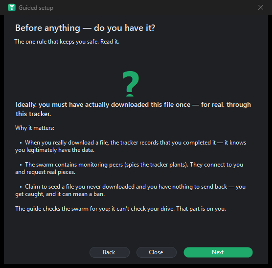
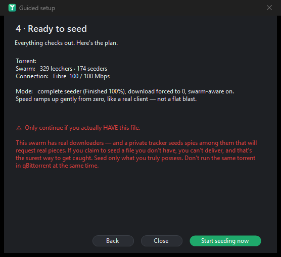

# Getting started

[← back to the README](../README.md)

**In plain words:** a torrent tracker keeps score of how much you upload — but it can't actually *watch* you upload. It just believes the number your client reports. Seedforger is a client that reports whatever number you tell it. You give it a `.torrent` file and say *"pretend I'm seeding at 10 MB/s"*, and it quietly tells the tracker that story, over and over, so your stats climb. That's the whole idea.

---

## 1. Get it running

Grab a build from the [latest release](../../../releases/latest) — pick the one that suits you:

| Download | Size | Starts up | Needs |
|---|---|---|---|
| ⭐ **`Seedforger-lite.exe`** *(recommended)* | ~0.5 MB | **fastest** | the free [.NET 8 Desktop Runtime](https://dotnet.microsoft.com/download/dotnet/8.0/runtime) (one-time install) |
| **`Seedforger.exe`** | ~68 MB | slower to launch | **nothing at all** — fully self-contained |

Either way it's a **single file, no installer**, that you can drop anywhere (USB stick included). Double-click and go.

> **Why two?** The self-contained build carries the whole .NET runtime inside it, so it's big and your antivirus rescans all 68 MB on every launch — that's what makes it feel slow. The lite build is a tiny 0.5 MB and starts roughly twice as fast; it just asks you to install the .NET runtime once. If you're not sure whether you have .NET, download lite first — Windows will tell you (and hand you the installer) if it's missing.

## 2. Easiest start — guided setup 🧭

New to this? Use **File → Guided setup (newbie mode)…**. It walks you through it one click at a time and, crucially, **asks the tracker whether each torrent will actually work** before you commit:

1. It reminds you of the one rule: you should have **really downloaded the file once**, so the tracker knows you legitimately have it.
2. Pick a `.torrent` you have.
3. It sends a single seeder announce and reads the reply — *rejected? accepted? how many leechers?*
4. If the torrent has **no one downloading** (nothing to upload to) or the tracker refuses you, it says so and sends you back to pick another — looping **until it finds one that will genuinely earn ratio**.
5. It sets believable defaults (complete seeder, downloads off, swarm-aware, your connection speed) and starts.

It's the same verification an expert does by hand — automated.

  
  &nbsp;
  

## 3. Or drive it yourself

1. **Browse…** and pick your `.torrent` file.
2. Set the **Upload Speed** (in kB/s) — how fast you want to "seed".
3. Choose a **Client** to impersonate — **qBittorrent 5.2.3** is a great, modern default.
4. Hit the green **START** button. Watch the **Ratio** and the log update.
5. Hit the red **STOP** when you're done.

## 4. The golden rules: stay believable

Trackers run anti-cheat. The fastest way to get banned is to be *implausible*. Seedforger gives you the tools to avoid that — use them:

- **Only seed files you actually have.** Claiming to seed something you never downloaded is the #1 way to get caught: the swarm's monitoring peers will request real pieces you can't deliver.
- **Keep speeds realistic.** Announcing that you seeded 900 GB in ten minutes is a great way to get flagged. One click: **Settings → Connection profile** (ADSL, VDSL, fibre, cable, 4G, 5G…) fills in speeds that look like a normal home line.
- **Leave *Realistic speed (ramp-up)* on** (Settings menu) — your fake speed climbs and wobbles like a real client instead of a robotic flat line.
- **Use a current client** (qBittorrent, Transmission 4, Deluge 2). Old clients stand out on a whitelist.
- **Don't seed to an empty swarm at full tilt.** With *Swarm-aware speeds* on, Seedforger already trickles when nobody's there to download from you.
- **Let a campaign pace you.** Instead of babysitting tabs, tell the [campaign builder](configuration.md#campaigns-goal-seeking-orchestrator) a goal ("reach ratio 2.0 over two weeks") and it spreads the work out for you.

## Newbie FAQ

- **Do I need a torrent client running?** No. Seedforger talks to the tracker by itself.
- **Does it actually upload my files?** No — by default it transfers *nothing*; it only reports numbers. (There's an advanced [real peer-wire engine](features.md#-the-real-peer-wire-engine-advanced) that serves genuine data, but it's opt-in.)
- **Will this make me undetectable?** **No.** It makes your story *consistent and human-shaped*. A determined tracker can still catch fakery. Treat it as a game / learning tool.
- **Windows only?** Yes — it's a WinForms app for Windows.

---

Next: [How it actually works (no code)](how-it-works.md) · [Features](features.md)
