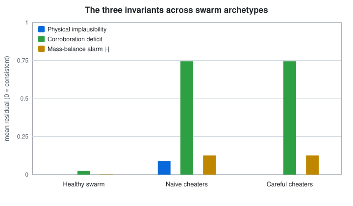
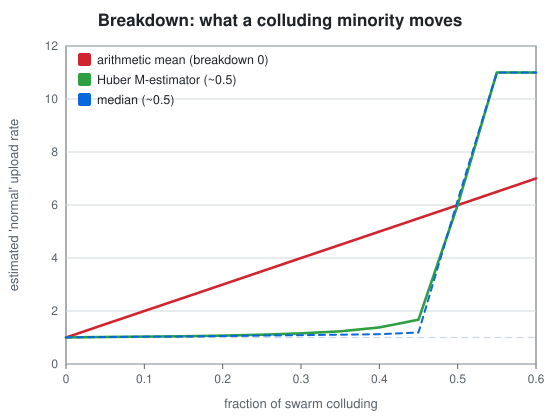
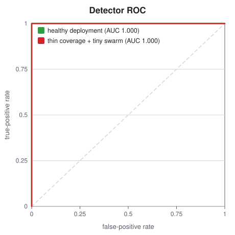
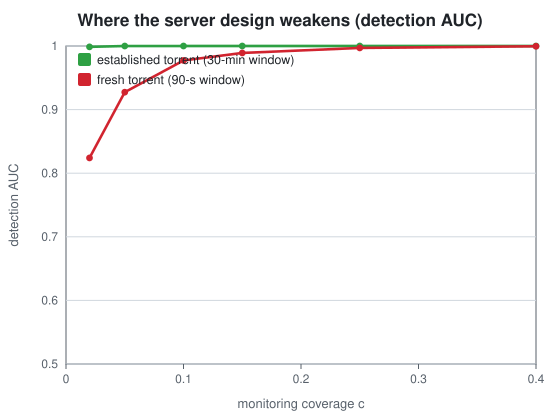

# Paper 1 — Reconciling the swarm

### Ratio cheating as robust anomaly detection on the tracker

> *A naive tracker believes the number you send. A mature one treats it as one noisy
> observation inside a web of partially redundant observations, and looks for the
> contradiction. This paper writes down the three contradictions a tracker can actually
> compute, turns them into a detector, and measures how well it works — and where it
> stops working.*

All numbers below come from [`figures/metrics.json`](figures/metrics.json), regenerated
from [`Seedforger.Integrity`](../../Seedforger.Integrity) and guarded by the xUnit suite.

---

## Part A — for everyone

A BitTorrent announce is a self-report. Your client tells the tracker "I uploaded 4 GB,"
and nothing in the base protocol proves it. So the obvious way to cheat is to send a big
number. The obvious defence is *not* to trust the number — but a tracker can't measure
your uplink directly either. What it **can** do is check whether your number is
consistent with everything else it can see. Three checks do most of the work.

**1. Physics.** You cannot upload faster than your uplink. If your declared upload over
a window implies 90 MB/s on a link that handshakes like a home connection, the claim
refutes itself. This one is cheap and catches lazy cheating.

**2. Mass balance.** Every byte *someone* downloaded, *someone else* uploaded. So across
a whole swarm, total declared upload should roughly equal total declared download.
Fabricated upload has no matching download anywhere — it makes the swarm's books stop
balancing. In the model, a healthy swarm sits at an imbalance of ~`0.001`; put 15 %
cheaters in it and the imbalance jumps to ~`0.13`. That's an alarm you can see without
accusing any single peer.

**3. Corroboration.** Trackers can run their own peers in the swarm. Anything you really
upload, some of those monitoring peers actually receive. If you *claim* to have uploaded
a lot but the monitors saw almost none of it, that gap — the **corroboration deficit** —
is the strongest per-peer signal there is. A genuine seeder's deficit sits near zero; a
peer declaring upload nobody received sits near one.

  

The picture tells the whole plain-language story. In a healthy swarm all three residuals
are flat. Naive cheaters trip *all three* — including physics, because they claim
impossible speeds. The interesting column is the last one: **careful** cheaters, who keep
their claimed speed plausible. They beat the physics check completely — and it doesn't
matter, because they can't manufacture bytes in someone else's inbox. Corroboration and
mass balance still light up. **You can fake how fast you claim to be; you cannot fake
that nobody received it.**

---

## Part B — for the hard of hearing

### B.1 Setup

Over one announce window a swarm is a set of peers `i = 1…N`. Each peer has a private
truth `(u_i, d_i)` — bytes actually uploaded and downloaded — and a public declaration
`(û_i, d̂_i)`. Honest peers satisfy `û_i ≈ u_i`, `d̂_i ≈ d_i` up to reporting noise. A
cheater sets `û_i = ρ·u_i` with inflation `ρ > 1` (and keeps `d̂_i` honest, since
inflating downloads would hurt the very ratio they are gaming).

The tracker observes every declaration, a physical link ceiling `L_i` from the handshake,
and a **corroboration measurement** `c_i`: of a peer's genuine upload, the fraction that
lands on a monitoring peer is `p` (the deployment's *coverage*), sampled at piece
granularity. It never observes `(u_i, d_i)` — that is the whole difficulty.

### B.2 The three residuals

Each is a pure function of observables (see [`Invariants.cs`](../../Seedforger.Integrity/Invariants.cs)):

- **Physical.** `r^phys_i = max(0, û_i /(W·L_i) − 1)` — fractional overshoot of the link ceiling over a window of length `W`.
- **Mass balance (swarm scalar).** `R^mass = (Σ û_i − Σ d̂_i)/(Σ û_i + Σ d̂_i) ∈ [−1,1]`. Because genuine transfers conserve bytes, `Σ u_i = Σ d_i`, so an honest swarm has `R^mass ≈ 0`; net-fabricated upload drives it positive.
- **Corroboration deficit.** `r^corr_i = clamp_{[0,1]}(1 − c_i /(p·û_i))`. For an honest peer `c_i ≈ p·u_i ≈ p·û_i`, so `r^corr_i ≈ 0`. For a cheater `c_i ≈ p·u_i = p·û_i/ρ`, so `r^corr_i ≈ 1 − 1/ρ`. **The coverage `p` cancels** — any non-zero monitoring yields signal; `p` only controls how noisy `c_i` is.

Per-peer detection uses `s_i = w_1 r^phys_i + w_2 r^corr_i`; the mass balance is a
swarm-level alarm, reported separately because a term identical for every peer cannot
change a per-peer ranking.

### B.3 It is not a threshold, it is an estimator

The tempting implementation — "flag anyone above a cutoff" — dies on real, dirty data:
NAT, buggy clients, asymmetric seedboxes, and missed announces all produce honest
outliers. The right object is a **robust location estimate** of what "normal" looks like,
against which residuals are judged. The estimator's **breakdown point** — the fraction of
coordinated liars needed to corrupt it — is the number that matters.

  

The arithmetic mean has breakdown point 0: a single unbounded liar drags it anywhere.
With 40 % of the swarm colluding on a far-away value, the mean of a distribution centred
at `1.0` is dragged to ~`5.0`, while the Huber M-estimator holds at ~`1.38` and the median
at ~`1.12`. The [Huber estimator](../../Seedforger.Integrity/RobustEstimator.cs) (iteratively
reweighted, points beyond `k` robust-σ down-weighted ∝ `1/|r|`) keeps a ~0.5 breakdown
point *and* stays efficient on clean data — which is why a mature tracker reconciles with
a robust statistic, not an average.

### B.4 How well does it work?

Sweeping the per-peer score threshold gives a ROC curve; the area under it (AUC) is the
probability the detector ranks a random cheater above a random honest peer.

  

In a healthy deployment (200 peers, 15 % coverage, 30-minute window) the separation is
essentially complete: **AUC ≈ 1.00** over 25 seeds, even against *careful* cheaters who
do real seeding and inflate only modestly. A peer that declares several times what any
monitor received simply has nowhere to hide.

### B.5 Where it breaks — the honest part

A detector paper that only reports its wins is marketing. The corroboration measurement
is a piece-level sample, so its relative noise grows like `√((1−p)/(p·m))` in the number
of pieces `m`. Two regimes make `m·p` small and the detector shaky:

  

- **Thin coverage** (`p → 0`): fewer monitors witness less, so `c_i` is noisier. On an
  established torrent the detector is robust to this (AUC stays ~`0.99` even at `p = 0.02`).
- **Fresh torrents** (short window, little volume, few pieces): here thin coverage bites.
  At `p = 0.02` on a 90-second-old torrent, **AUC falls to ~`0.82`** — still well above the
  `0.5` coin flip, but visibly degraded.

These are not leaks of anyone's secret rules; they are intrinsic properties of sampling.
They also say exactly where a tracker should *not* lean on corroboration alone — the
opening minutes of a fresh torrent — and where mass balance and physics have to carry the
load instead.

### B.6 What Paper 1 establishes

A tracker that reconciles rather than trusts can detect ratio inflation with near-perfect
accuracy across the ordinary operating range, using only data it already holds, and
robustly against a colluding minority up to ~half the swarm. The residual blind spot is a
narrow, characterised regime — thin coverage on a fresh torrent — not a general weakness.

Paper 2 takes the next step: it shows that against a detector like this one, the client's
optimisation problem is not merely hard but *ill-posed*.

→ **[Paper 2 — The client can't win](02-client-asymmetry.md)**
