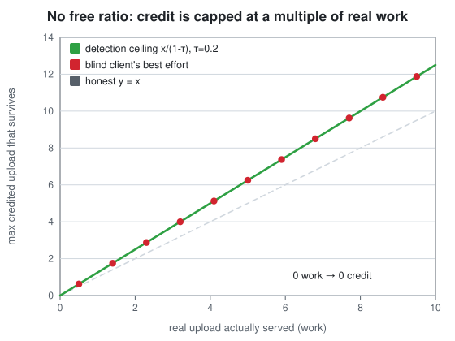

# Paper 2 — The client can't win

### Information asymmetry as a design, and why client-side optimisation is ill-posed

> *The first paper built a detector. This one proves what that detector does to the
> other side: it turns the client's problem into one it structurally cannot solve. The
> result is negative — the interesting, honest kind of negative — and it comes with the
> exact conditions under which it holds.*

All numbers below come from [`figures/metrics.json`](figures/metrics.json), regenerated
from [`Seedforger.Integrity`](../../Seedforger.Integrity) and guarded by the xUnit suite.

---

## Part A — for everyone

Here is the uncomfortable thing about a well-run tracker: **the score you are chasing is
computed from a number you can't see.**

You control what you *declare*. But the tracker credits you based partly on what its
monitoring peers *witnessed* — and you have no way to read that signal, and no way to
forge it, because forging it would mean actually delivering bytes to those peers. Which
is just… uploading for real.

So picture the game. You do some genuine work — call it `w` — and then you inflate,
declaring more than `w`. The tracker runs the corroboration check from Paper 1. It
witnesses a fraction of your *real* work, expects your declaration to match, and flags you
when the gap is too large. Work through the arithmetic and a hard wall appears: **the most
you can declare without getting flagged is `w /(1 − τ)`**, where `τ` is the tracker's
tolerance. That is a fixed multiple of your *real* work — nothing you do on the client
changes it.

<p align="center">
  
</p>

Two things fall straight out:

- **No free ratio.** If your real work is `w = 0`, the ceiling is `0`. Zero real upload
  earns zero credit that survives. Not "a little"; zero.
- **The multiplier is fixed by the tracker, not by you.** At a tolerance of `τ = 0.2`, the
  cap is `1/(1−0.2) = 1.25×` your real work. A better client, a smarter schedule, a more
  perfect fingerprint — none of it moves that `1.25`. The red dots on the figure are a
  client that searches as hard as it can, blind to the corroboration signal; every one of
  them lands *exactly* on the ceiling the tracker set.

The punchline for anyone building a client: **you are optimising the wrong variable.** The
only input that raises the ceiling is `w` — real upload actually served. Which is why the
durable engineering isn't in fabricating numbers, it's in seeding well.

---

## Part B — for the hard of hearing

### B.1 The game

A single client chooses a declared upload `D` after doing genuine work `w ≥ 0`. The
server credits `D` but runs the corroboration-deficit detector of Paper 1. Corroboration
witnesses genuine work at coverage `p`, so the witnessed volume is `c = p·w`. The server's
estimate of the deficit is

```
deficit(D) = 1 − c /(p·D) = 1 − (p·w)/(p·D) = 1 − w/D.
```

Note again that **`p` cancels**: the deficit depends only on the ratio of real to declared
work, not on how much monitoring is deployed. The server flags when `deficit(D) > τ`.

### B.2 The ceiling (closed form)

Solving `deficit(D) = τ`:

```
1 − w/D = τ   ⇒   D* = w /(1 − τ).
```

So the largest declaration that survives detection is `D*(w) = w/(1−τ)`
([`AsymmetryGame.MaxUndetectedDeclaredUp`](../../Seedforger.Integrity/AsymmetryGame.cs)),
and the **credit multiplier over real work** is

```
M(τ) = D*/w = 1/(1 − τ),
```

independent of `w` and of everything the client controls. At `τ = 0.2`, `M = 1.25`
(`game_credit_multiplier` in the metrics). At `w = 0`, `D* = 0`
(`game_free_ratio_at_zero_work = 0`).

### B.3 The client plays blind — and still hits the wall

The client cannot observe `c` (it does not know which peers are monitors, nor what they
received). Its only oracle is binary: *did declaring `D` get me flagged?* The best it can
do is probe — push `D` up, back off when flagged. [`BlindClientBestDeclared`](../../Seedforger.Integrity/AsymmetryGame.cs)
implements exactly this binary search, and it converges to `w/(1−τ)` to within `10⁻³` for
every level of real work tested (the theory in `AsymmetryGameTests`). A blind optimiser
against a graded-but-hidden variable does not do *better* than the closed form — it
reproduces it. There is no clever client strategy hiding in the gap, because there is no
gap.

### B.4 Why this is a mechanism, not a heuristic

Frame the credited ratio `R` as the objective and the declaration `D` as the client's
lever. The server computes `R` from a signal vector `S` whose corroboration component is
**non-observable and non-influenceable** by the client except through `w` itself. Under
that condition, the client's maximisation of `R` has no interior optimum in the fabricated
dimension: every unit of inflation beyond `w/(1−τ)` is strictly detected, and every unit
below is dominated by simply raising `w`. This is the structure of an **incentive-compatible
mechanism** — truth-telling is optimal not by anyone's goodwill but by the geometry of who
can see what. The tracker didn't out-code the client; it arranged the information so the
client is grading its own homework blind.

### B.5 When the proof runs out — the boundary

The result assumes the server can measure the deficit *reliably enough* to set a tight
`τ`. Paper 1 §B.5 shows exactly when it can't, and those are precisely the conditions that
relax the ceiling:

- **`p → 0` (no monitoring peers).** With coverage genuinely zero, `c` carries no
  information and the deficit is undefined — the corroboration term vanishes and only mass
  balance and physics remain. A tracker that deploys *no* monitors has opted out of this
  mechanism.
- **Fresh torrents / tiny volume.** When the piece count `m` is small, the deficit
  estimate is noisy (relative noise `√((1−p)/(p·m))`), forcing a larger safety margin `τ`
  and thus a looser multiplier `1/(1−τ)`. The metrics quantify the detection cost:
  AUC ~`0.99` on an established torrent at `p = 0.02` versus ~`0.82` on a fresh one.
- **Small swarms.** Few peers make the mass-balance scalar high-variance, weakening the
  swarm-level backstop that would otherwise cover the corroboration blind spot.

Outside these regimes the ceiling is sharp. Inside them it is soft — and a tracker that
knows this simply widens `τ` (accepting more inflation) or leans on the other two
invariants during a torrent's opening minutes. Either way the client still cannot see the
variable it is graded on; the boundary changes the *tightness* of the cap, not the fact of
it.

### B.6 What the two papers establish together

Paper 1 built an estimator that reconciles declarations against physics, swarm mass
balance, and monitoring corroboration, and measured it: near-perfect across the ordinary
range, robust to a colluding minority, with a small, characterised blind spot. Paper 2
showed that against such an estimator the client faces a capped, incentive-compatible
game: credit is bounded by a fixed multiple of *real work*, zero work earns zero, and a
blind client's best effort merely reproduces the ceiling the server chose.

The engineering conclusion is not despair — it's redirection. The only lever that moves
the ceiling is `w`, real upload actually served. That is why Seedforger's most valuable
component is the one that isn't about faking anything at all: the **real, hash-verified
peer-wire engine**. Optimise *that*, and you're finally optimising the variable the
tracker is actually grading.

← **[Paper 1 — Reconciling the swarm](01-swarm-integrity.md)** · **[Annex index](README.md)**
